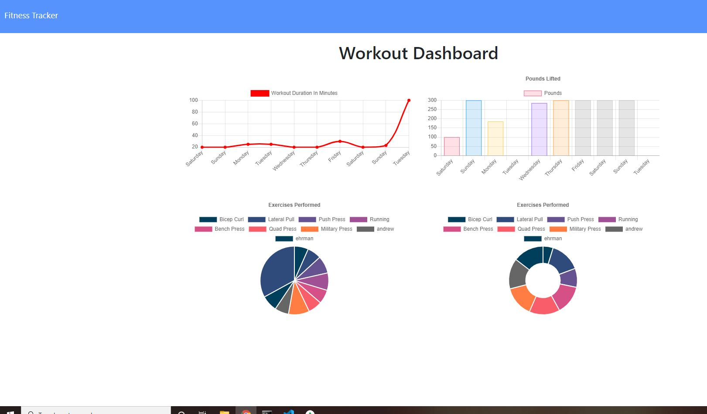

# FitnessTracker

## Table of Contents
[Description](#description)

[Installation](#installation)

[Usage](#usage)

[Credits](#credits)

## Description
This repository contains a full stack web app That communicates with a mongo database. The program allows the user to submit workouts with multiple exercises. This data is saved in a database. The user can then view stats about there past seven worklouts. 

### Stats page
    Displays data bout the last seven workouts.

## Installation
Downloading respository. In directory run npm install. This program requires a mongodb cluster. PLace the username and password of the cluster into a .env folder to connect. Then if desired use npm run seed to insert sample data into the database.

## Usage
The application is deployed to https://shrouded-beyond-15594.herokuapp.com/.
Server can be run in test usage with node server.js command.

## Credits
Made By Andrew Ehrman.

### Components Used
Node

npm packages
    "dotenv": "^8.2.0",

    "express": "^4.16.3",

    "mongoose": "^5.3.16",

    "morgan": "^1.9.1"